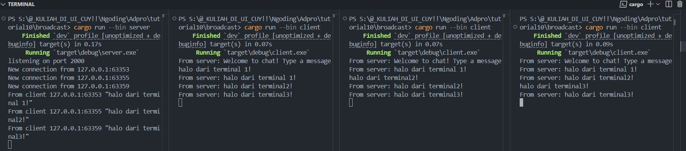
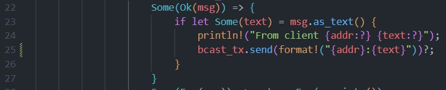
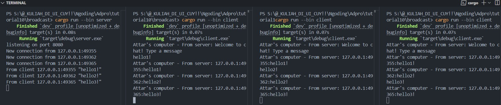
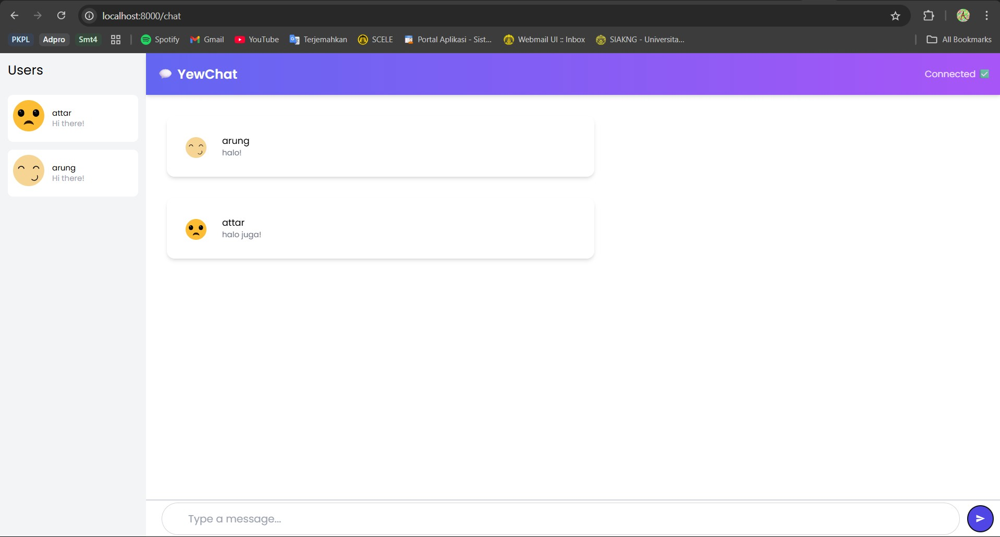
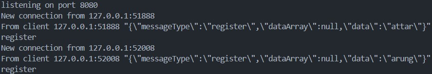

    <h1>MODULE 10 - BROADCAST</h1>

    

    <h2>Alwie Attar Elfandra</h2>
    <h2>2306241726</h2>

__2.1. Original code of broadcast chat__

    

- Untuk run server: `cargo run --bin server`
- Untuk run client: `cargo run --bin client`

Dari output yang terlihat, awal mula setiap client yang ter run akan terhubung ke server lalu ketika kita memberikan pesan dari satu client maka setiap klien dan server akan menerima pesan siaran dari klien pertama yang memberikan tersebut. 

Setiap kali seorang klien memasukkan pesan melalui baris perintah, pesan tersebut akan dikirimkan ke server dan kemudian server akan meneruskannya ke semua klien yang terhubung.

__2.2: Modifying port__

    

Gambar di atas adalah gambar dari server dan client yang tidak memiliki port yang sama (server 2000, client 8080). Hal ini menyebabkan ketidakkonekan antarserver dan client sehingga koneksi tidak dapat dijalankan

    

Gambar di atas adalah kondisi ketika client dan server sudah berada di port yang sama yaitu 8080, dengan port yang sama ini menunjukkan bahwa client dan server dapat terkoneksi. Ini menunjukkan bahwa jika client diubah portnya maka server juga harus diubah karena ini adalah komunikasi 2 arah antarserver dan client

__2.3 : Small changes, add IP and Port__

    

Dengan edit kode berikut, diharapkan ketika satu client mengirimkan pesan ke server dan server mengirimkan ke semua clientnya akan dikirim jg IP dan port dari client yang mengirimkan pesan dengan variabel `addr` yang sudah dipersiapkan dalam `bcast_tx` sebagai wadah pesan yang digunakan.

Berikut hasilnya:

    

__Bonus: Rust Websocket server for YewChat!__

    

    

Saya berhasil menghubungkan aplikasi YewChat ke server WebSocket yang dibangun sepenuhnya menggunakan Rust dengan menggantikan server JavaScript dari tutorial sebelumnya. Proses ini melibatkan modifikasi pada server Rust agar mampu menerima, memproses, dan membroadcast pesan dalam format JSON yang sesuai dengan struktur `WebSocketMessage` dari YewChat. Dengan menggunakan serialisasi dan deserialisasi `serde`, saya memastikan komunikasi antara frontend dan backend berlangsung mulus. Jika dibandingkan dengan metode sebelumnya yang menggunakan JavaScript sebagai server, pendekatan berbasis Rust ini lebih konsisten, efisien, dan memberikan kontrol penuh atas performa, debugging, serta keamanan. Selain itu, menggunakan Rust end-to-end memperkuat kohesi teknologi dalam proyek ini dan mengurangi ketergantungan lintas bahasa.
