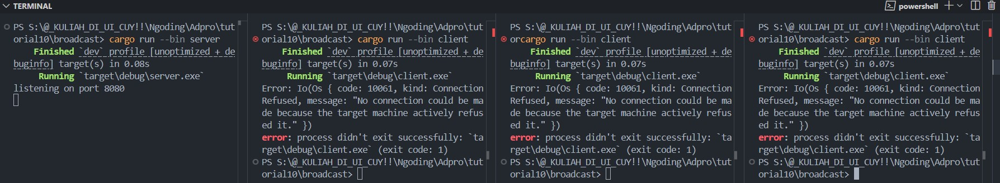
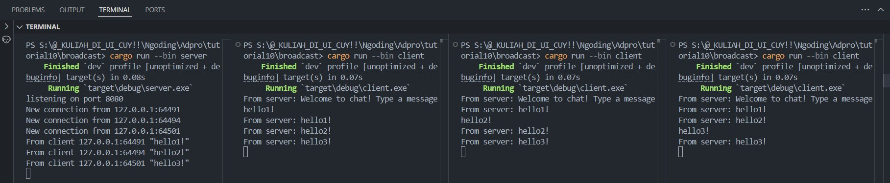

    <h1>MODULE 10 - BROADCAST</h1>

    

    <h2>Alwie Attar Elfandra</h2>
    <h2>2306241726</h2>

__2.1. Original code of broadcast chat__

    

- Untuk run server: `cargo run --bin server`
- Untuk run client: `cargo run --bin client`

Dari output yang terlihat, awal mula setiap client yang ter run akan terhubung ke server lalu ketika kita memberikan pesan dari satu client maka setiap klien dan server akan menerima pesan siaran dari klien pertama yang memberikan tersebut. 

Setiap kali seorang klien memasukkan pesan melalui baris perintah, pesan tersebut akan dikirimkan ke server dan kemudian server akan meneruskannya ke semua klien yang terhubung.

__2.2: Modifying port__

    

Gambar di atas adalah gambar dari server dan client yang tidak memiliki port yang sama (server 2000, client 8080). Hal ini menyebabkan ketidakkonekan antarserver dan client sehingga koneksi tidak dapat dijalankan

    

Gambar di atas adalah kondisi ketika client dan server sudah berada di port yang sama yaitu 8080, dengan port yang sama ini menunjukkan bahwa client dan server dapat terkoneksi. Ini menunjukkan bahwa jika client diubah portnya maka server juga harus diubah karena ini adalah komunikasi 2 arah antarserver dan client